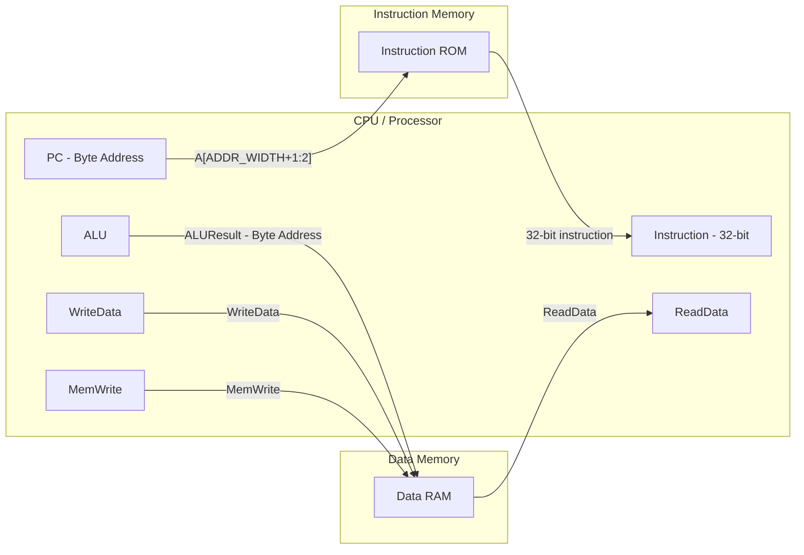

# Subproject 06 - Instruction and Data Memories

## Engineering objective

Model the memory interfaces required by the single-cycle core while preserving
RISC-V byte addressing at the processor boundary.

## Architecture



## Memory semantics

- Both arrays store 32-bit words.
- Processor addresses are byte addresses; bits `A[1:0]` are removed before
  indexing the arrays.
- Instruction memory loads `MEMFILE` with `$readmemh` and pre-fills unused words
  with the RISC-V NOP encoding.
- Data memory writes synchronously and reads combinationally.
- Reset gates external read data but does not synchronously clear the RAM array.

## Verification strategy

`Memories_tb.v` checks reset outputs, HEX initialization, byte-address to
word-index conversion, two RAM writes, retained data, and write-enable blocking.

## Run

```bash
vsim -c -do run_questa.do
gtkwave memories.vcd
```

Expected verdict: `TEST MEMORIES PASSED`.

## Review focus

The important integration boundary is address interpretation. Using the full
byte address directly as an array index would place accesses four words apart
and break software-visible memory semantics.

## Verification matrix

| Requirement | Evidence |
|---|---|
| ROM initialization | Known words are loaded from `mem_test.hex` |
| Byte-to-word conversion | Addresses `0`, `4`, and `8` select consecutive words |
| Synchronous RAM write | Memory changes only on the rising edge with `WE=1` |
| Combinational RAM read | The selected word is visible without another clock edge |
| Write suppression | `WE=0` preserves the previous memory contents |
| Reset visibility | Read outputs are forced to benign values while reset is active |

## Integration role

Instruction memory supplies the current 32-bit instruction from `PC`. Data
memory receives the ALU effective address and `rs2` store data, then returns the
word selected by `LW` for write-back.

## Scope boundary

These are behavioral simulation models, not cache or bus-interface designs.
There is no byte-enable support, wait-state protocol, alignment checking,
protection, arbitration, or memory-mapped peripheral interface.
